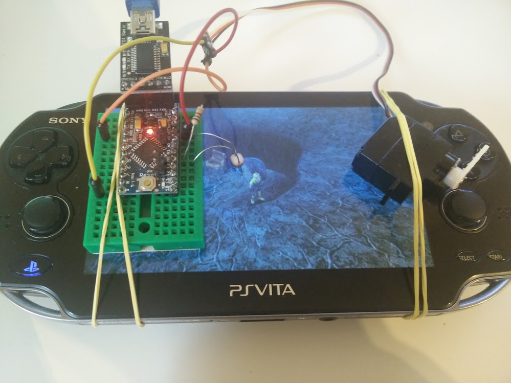

## Description

Avoid lightning strikes on Final Fantasy X by using an Arduino + LDR + Servo

<blockquote class="twitter-video" data-lang="en">
Lightning dancing like a machine. Presenting lightning-dodge-O-matic <a href="https://twitter.com/hashtag/FFX?src=hash">#FFX</a> <a href="https://twitter.com/hashtag/Lulu?src=hash">#Lulu</a> <a href="https://twitter.com/hashtag/Arduino?src=hash">#Arduino</a> <a href="https://t.co/WMLX1CRwSN">pic.twitter.com/WMLX1CRwSN</a>
&mdash; Javi Rengel (@rephus) <a href="https://twitter.com/rephus/status/742057060456648709">June 12, 2016</a></blockquote>

## Hardware schema

TODO
